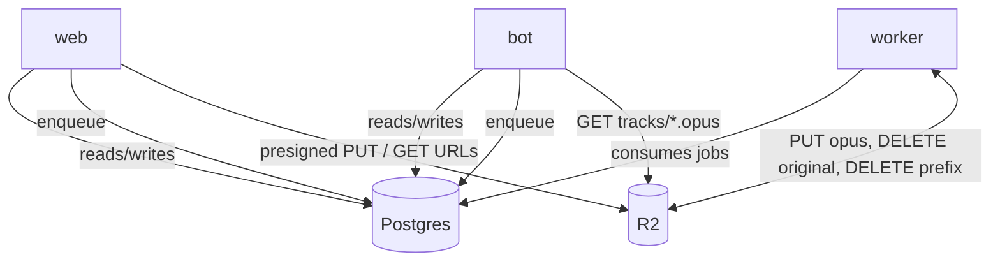
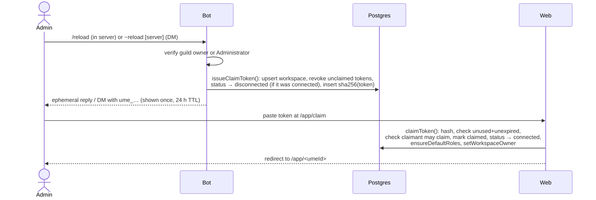

# Ume architecture

How the pieces fit. The *why* is in [`PLAN_REVIEW.md`](PLAN_REVIEW.md); the deployment mechanics are in [`DEPLOY.md`](DEPLOY.md). Where this document and the code disagree, the contracts in `packages/shared` and `packages/db` win.

## Processes

| Process | Package | Runtime | Talks to | Responsibility |
| --- | --- | --- | --- | --- |
| **web** | `apps/web` | Next.js 16 App Router on Vercel (Node runtime) | Postgres (pooled), R2 (presign only), Stripe, Resend, Discord OAuth, pg-boss (enqueue) | Marketing site, sign-in, workspace dashboard (`/app/<umeId>`), CEO console (`/ceo`), all privileged mutations, Stripe webhooks, DMCA form |
| **bot** | `apps/bot` | Node 22 container, one instance | Discord gateway + voice, Postgres (direct), R2 (GET), pg-boss (enqueue) | 24/7 voice presence, slash and `~` commands, claim tokens, confirmation codes, playback from stored Opus, activity heartbeat |
| **worker** | `apps/worker` | Node 22 container with ffmpeg and yt-dlp | Postgres (direct), R2, Resend | pg-boss consumers: transcode, YouTube ingest, sweeps, purges, storage reconciliation, email |

Shared state is one Postgres database (app tables + the pg-boss schema) and one R2 bucket. There is no Redis and no inter-process HTTP; the processes coordinate through rows and jobs.



## Identifiers

| Id | Shape | Where it appears |
| --- | --- | --- |
| `workspaces.id` | `ws_01J…` (prefixed ULID) | Foreign keys, storage prefix `ws/<id>/`, job payloads. Internal. |
| `workspaces.umeId` | `ume-01j…-xxxxxxxx` | URLs (`/app/<umeId>`), Settings page, support tickets. Public but opaque; not a secret. |
| `workspaces.guildId` | Discord snowflake | The Discord server. Unique per workspace. The bot keys everything by it. |
| Other rows | `pl_`, `trk_`, `inv_`, `rol_`, `mem_`, `clt_`, `act_`, `aud_`, `bt_`, `rm_` | See `newId(kind)` in `@ume/shared`. Sortable, URL-safe, self-describing in logs. |

## Data flows

### Claiming a server

Two doors lead to the same `connected` workspace with the claimant as Owner.

**A. OAuth claim (default path).** The user signs in with Discord (`identify email guilds`). The web app fetches `/users/@me/guilds` with the user's access token and filters with `canClaimGuild()` (owner **or** Administrator bit; Manage Server is deliberately not enough). Picking a server where the bot is already installed creates or connects the workspace; if the bot is not installed, the picker links to `botInviteUrl(clientId, guildId)` first.

**B. Token claim.** For admins who prefer not to grant the `guilds` scope, or to reconnect after a rotation.



Rules encoded in `claimToken()`:

- an unclaimed workspace: the claimant becomes Owner;
- a disconnected workspace: the current Owner, a user explicitly allowed to reconnect (members with `MANAGE_SETTINGS`), or the verified Discord guild owner may reconnect. The Discord guild owner also takes ownership;
- a used, revoked or expired token is dead forever; `/reload` revokes every live token for the guild before issuing a new one.

`/reload` on a connected workspace flips it to `disconnected`: `getAccess()` then strips every capability except `VIEW_LIBRARY`, `MANAGE_SETTINGS`, `MANAGE_BILLING` and `DANGER_ZONE`, so the library is readable and the Owner can re-enter a token, but nothing else changes until the new token is claimed.

### Upload → transcode → play

```mermaid
sequenceDiagram
  actor Member
  participant Web
  participant R2
  participant DB as Postgres / pg-boss
  participant Worker
  participant Bot

  Member->>Web: drop file (uploadRequestSchema: name, size ≤ 100 MB, mime)
  Web->>Web: requireUser, getAccess, can(ADD_TRACK), quota check,<br/>uploads_enabled flag, blocked_hashes
  Web->>DB: insert track (status pending, original_storage_key)
  Web-->>Member: presigned PUT for ws/<ws>/uploads/<trk>/<file>
  Member->>R2: PUT bytes directly (CORS)
  Member->>Web: "uploaded" → enqueue transcode-upload {trackId, workspaceId}
  DB-->>Worker: transcode-upload
  Worker->>R2: GET original
  Worker->>Worker: file-type sniff, music-metadata (title/artist/album/cover),<br/>sha256, ffmpeg → 48 kHz stereo Opus 128 kbps, loudnorm I=-14
  Worker->>R2: PUT tracks/<trk>.opus (+ covers/<trk>.jpg), DELETE original
  Worker->>DB: track ready, size_bytes, duration; recountPlaylist; recomputeWorkspaceUsage; touchActivity
  Member->>Bot: /play <playlist|title>
  Bot->>DB: resolveDiscordAccess → can(CONTROL_PLAYBACK); pick ready tracks
  Bot->>R2: GET tracks/<trk>.opus (stream)
  Bot->>Bot: demux Ogg/Opus → voice packets (no transcoding)
```

Why it is shaped like this:

- The web server never touches audio bytes; Vercel functions have short timeouts and small bodies.
- Everything is normalized to one Opus rendition at `UPLOAD.output` settings. The bot plays it with zero CPU work, storage is predictable (1 GB ≈ 18 hours), and loudness is consistent across a playlist.
- Deduplication is per workspace by `sha256` (uploads) and `youtube_id` (links) via unique indexes.
- Only the Opus output and cover count against quota (`tracks.size_bytes`); `reconcile-storage` recomputes `workspaces.storage_used_bytes` daily and deletes orphaned objects.

### YouTube: linked vs ingested

Adding a YouTube URL (`/add playlist url` or the web) always creates a **linked** track: `source = youtube`, `youtube_id`, title/channel/thumbnail from oEmbed, no audio in storage. It shows in the playlist like any other entry and opens on YouTube.

Audio is only fetched when the global feature flag `youtube_ingest` is on (CEO console, off by default, with a warning) **and** the workspace's `youtube_enabled` is true. Then the web/bot enqueues `ingest-youtube`, the worker runs `yt-dlp` (optionally with `YTDLP_COOKIES`), pipes through the same ffmpeg normalization, and the track becomes `ready` with a `storage_key`. Turning the flag off later leaves existing ingested audio in place but stops new ingests; consequences are spelled out in [`OPERATIONS.md`](OPERATIONS.md#youtube-ingest-flag-on--off).

### Activity and the inactivity sweep

`touchActivity()` inserts an `activity_events` row and bumps `workspaces.last_activity_at`, clearing any sent-notice timestamps. Activity is: a human in the home voice channel, any command, any playback, any web edit or upload. Bot presence alone does not count.

`inactivity-sweep` runs daily (pg-boss schedule) when `auto_purge_enabled` is on:

1. Free workspaces idle ≥ 30 days and no 30-day notice yet → `notifications` + email (`inactivity30dEmail`) + Discord DM to the Owner + message in `notice_text_channel_id`; stamp `inactivity_notice_30d_sent_at`.
2. Idle ≥ 60 days − 48 h and no 48-hour notice → same set of notices (`inactivity48hEmail`); stamp `inactivity_notice_48h_sent_at`.
3. Idle ≥ 60 days with both notices sent → enqueue `purge-workspace { reason: 'inactivity' }`.

Paid workspaces are never auto-purged; if a subscription lapses they downgrade to Free and the 60-day clock starts from their last activity.

### Purge

Three triggers converge on one job:

- **Owner**: `/purge` (or `~purge` in a DM) → bot stores `sha256(code)` in `danger_confirmations` with a 5-minute TTL → `~confirm CODE` → `purge-workspace { reason: 'owner' }`. The web Danger Zone does the same with a typed server name.
- **Inactivity**: the sweep above.
- **CEO**: from the console, `reason: 'ceo'`.

The worker sets `status = purging`, deletes the R2 prefix `ws/<workspaceId>/` (paged `DeleteObjects`), deletes library rows (cascades from `workspaces`), sends `purgedEmail`, and leaves a `purged` tombstone (`purged_at`) for 30 days for support before the row is hard-deleted. While `purging`/`purged`, `issueClaimToken()` refuses to issue tokens for the guild; a fresh workspace can be created after the tombstone is gone.

`/reset` is the smaller sibling: same confirmation flow, then `removeAllMembersExceptOwner()`, revoke all invites, and disconnect. Playlists and music stay.

### Roles, capabilities and access resolution

Roles are bitmasks over `CAP` (`packages/shared/src/roles.ts`). The four system roles are created per workspace by `ensureDefaultRoles()` and cannot be deleted (they can be renamed and, except Owner, edited):

| Role | Capabilities |
| --- | --- |
| Owner | all, exactly one per workspace, holds `MANAGE_BILLING` and `DANGER_ZONE` which no other role may have (`OWNER_ONLY_CAPS`, enforced by `sanitizeCapsForNonOwner`) |
| Master | view, add, delete own/any, edit meta, manage playlists, control playback, manage members, invites, settings |
| Servant | view, add, control playback |
| Peon | view, control playback (read-only on the web) |

`getAccess(db, workspaceId, userId)` returns `{ workspace, membership, role, caps, isOwner }`; `can(access, CAP.X)` is the only check the web should use. For Discord, `resolveDiscordAccess(db, guildId, discordUserId)` maps the Discord id to the linked user (via `users.discord_user_id`, set from OAuth) and falls back to `workspaces.default_role_id` (Peon by default) for guild members without a membership. Non-`connected` workspaces yield zero capabilities on the bot side.

Membership sources (`memberships.source`): `owner`, `manual`, `invite_link`, `email_invite`, `discord_role_map`, `default_role`. Memberships can carry `expires_at` for temporary DJs; `expire-things` removes them hourly.

**Discord role mapping** (`discord_role_maps`): `@DJ → Servant`, `@everyone → Peon`. Applied at sign-in and on demand when `discord_role_sync_enabled`; highest role position wins. Most servers never need invites.

### Invites

Two kinds, one table, one URL shape `/invite/<token>`:

| | Share link | Email invite |
| --- | --- | --- |
| Token | 32 base32 chars, stored in clear (it is the URL) | same, plus bound `email` |
| Max role | anything passing `roleGrantableByLink()`: no `DELETE_ANY_TRACK`, `MANAGE_*`, owner caps → effectively Servant or below | anything passing `roleGrantableByEmail()`: everything except owner-only caps → up to Master |
| Guard | `require_guild_member` (default on) checks the claimant's OAuth guilds include the server | the signed-in user's email must equal the invite's email |
| Limits | `max_uses`, `expires_at` (default 7 days, max 365) | `expires_at`, one use |
| Membership | optional `membership_expires_at` | same |

Links are bearer credentials, which is why they cannot hand out delete-all or people-management rights. `inviteCreateSchema` validates the form; `MANAGE_INVITES` is required to create or revoke. `/reset` revokes every invite.

### Stripe

The server Owner pays per workspace. Flow: Billing page → Checkout Session (`customer` = existing `stripe_customer_id` or new, `client_reference_id` = workspace id, price from `STRIPE_PRICE_*`) → `checkout.session.completed` webhook stores `stripe_customer_id` / `stripe_subscription_id` and sets `plan` → `customer.subscription.updated/deleted` keep `plan`, `stripe_subscription_status` and `plan_renews_at` in sync → `invoice.payment_failed` sends a warning. Every event id is inserted into `stripe_events` first; a duplicate is skipped, which makes retries idempotent. The Customer Portal handles card changes, plan switches and cancellation.

Quota: `effectiveQuotaBytes(workspace)` = CEO override or the plan's bytes. Over quota means uploads are refused (`quotaWarningEmail` at 90 %) but nothing is ever deleted for being over quota.

## Job queues (pg-boss)

Defined once in `packages/shared/src/jobs.ts`; enqueued by web and bot, consumed by the worker. Queue name = job name.

| Queue | Payload | Trigger | Retries (delay, backoff) | Expires |
| --- | --- | --- | --- | --- |
| `transcode-upload` | `{ trackId, workspaceId }` | web, after the browser finishes its presigned PUT | 3 (30 s, exponential) | 15 min |
| `ingest-youtube` | `{ trackId, workspaceId, youtubeId, requestedBy… }` | web / bot, only when `youtube_ingest` is on | 2 (60 s, exponential) | 15 min |
| `purge-workspace` | `{ workspaceId, reason: owner \| inactivity \| ceo, requestedBy… }` | bot `~confirm`, web Danger Zone, sweep, CEO | 5 (60 s, exponential) | 30 min |
| `inactivity-sweep` | `{}` | daily schedule | 1 (300 s) | 30 min |
| `reconcile-storage` | `{}` | daily schedule | 1 (300 s) | 60 min |
| `expire-things` | `{}` | hourly schedule | 1 (300 s) | 10 min |
| `send-email` | `{ to, subject, html, text, kind, workspaceId?, userId? }` | any process needing retry-safe mail | 5 (30 s, exponential) | 5 min |

`JOB_OPTIONS` carries these numbers; use it when calling `boss.send()` so the policy is not duplicated. Long-lived processes connect with `directDatabaseUrl()`.

## Security model

- **Server-side authorization everywhere.** Every server action and route handler in `apps/web` starts with `requireUser()` → `getAccess(db, workspaceId, session.user.id)` → `can(access, CAP.X)` (or `access.isOwner` for owner-only operations). `src/proxy.ts` only checks that a session cookie exists; it is a UX shortcut, not a security boundary. All queries are scoped by `workspaceId` to prevent IDOR, and inputs are validated with zod schemas from `@ume/shared`.
- **Verified identity.** Discord ids come from OAuth `identify`, never from user input. Claiming requires guild owner or Administrator as reported by Discord's `/users/@me/guilds`, re-checked on the bot for every privileged command.
- **Hashed secrets.** Claim tokens (`ume_` + 40 base32 = 200 bits) and confirmation codes are stored only as SHA-256 hashes; the clear value is shown once in an ephemeral reply or DM. Tokens expire after 24 h, are single-use, and are revoked wholesale on rotation. Comparisons use `timingSafeEqual`.
- **Ephemeral replies.** Slash commands answer ephemerally so tokens and codes never sit in a public channel; privileged commands are hidden from non-admins with `default_member_permissions`.
- **Bearer-credential limits.** Share links cap at Servant-level capabilities and require guild membership by default; anything that can delete others' work or manage people needs an email-bound invite. Owner-only capabilities cannot be granted to any role.
- **CEO gate.** `requireCeo()` needs a session, an email on `CEO_EMAILS`, a verified email, and a Google-provider account row. Discord sign-in with a matching email is refused. CEO mutations are audit-logged with a null workspace id.
- **Secrets per process.** The bot holds the bot token; the web holds OAuth client secrets, Stripe and Better Auth secrets; the worker holds only storage and mail. No process has more than it needs, and nothing is committed (`.env` is git-ignored).
- **Audit trail.** `logAudit()` records every privileged mutation (`workspace.claim`, `token.rotate`, `invite.create`, `purge.confirm`, `ceo.flag.update`, …) with actor, target, metadata and IP; visible per workspace and globally in the CEO console.
- **Content controls.** `blocked_hashes` prevents re-upload of taken-down content; `tracks.status = disabled` blocks playback and download while keeping the object for counter-notice; `dmca_notices` tracks the process. Global kill-switches (`uploads_enabled`, `signups_open`, `auto_purge_enabled`, `maintenance_banner`, `youtube_ingest`) live in `feature_flags`.
- **Webhook integrity.** Stripe signatures are verified with `STRIPE_WEBHOOK_SECRET`; `/api/cron/*` requires `CRON_SECRET`.
