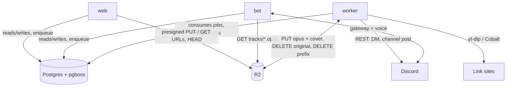
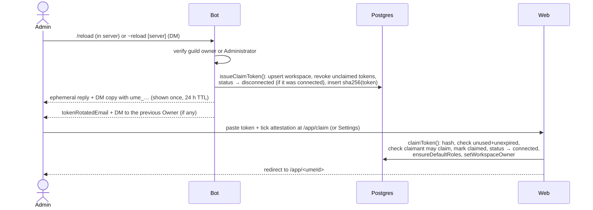

# Ume architecture

How the pieces fit. The *why* is in [`PLAN_REVIEW.md`](PLAN_REVIEW.md); the deployment mechanics are in [`DEPLOY.md`](DEPLOY.md). Where this document and the code disagree, the contracts in `packages/shared` and `packages/db` win.

## Processes

| Process | Package | Runtime | Talks to | Responsibility |
| --- | --- | --- | --- | --- |
| **web** | `apps/web` | Next.js 16 App Router on Vercel (Node runtime) | Postgres (pooled), R2 (presign + HEAD), Stripe, Resend, Discord OAuth + REST, site oEmbed endpoints, pg-boss (enqueue) | Marketing site, sign-in, workspace dashboard (`/app/<umeId>`), CEO console (`/ceo`), all privileged mutations, Stripe webhooks, DMCA form |
| **bot** | `apps/bot` | Node 22 container, exactly one instance | Discord gateway + voice, Postgres (direct), R2 (GET), Resend, site oEmbed endpoints, pg-boss (enqueue) | 24/7 voice presence, slash and `~` commands, claim tokens, confirmation codes, "add from link" entries, playback from stored Opus, heartbeat |
| **worker** | `apps/worker` | Node 22 container with ffmpeg and yt-dlp (one cloud instance, optionally a second residential instance) | Postgres (direct), R2, Resend, Discord REST (DMs, channel posts), yt-dlp or a Cobalt API | pg-boss consumers: transcode, link extraction, sweeps, purges, storage reconciliation, email |

Shared state is one Postgres database (app tables + the `pgboss` schema) and one R2 bucket. There is no Redis and no inter-process HTTP; the processes coordinate through rows and jobs.



## Identifiers

| Id | Shape | Where it appears |
| --- | --- | --- |
| `workspaces.id` | `ws_01J…` (prefixed ULID) | Foreign keys, storage prefix `ws/<id>/`, job payloads. Internal. |
| `workspaces.umeId` | `ume-01j…-xxxxxxxx` | URLs (`/app/<umeId>`), Settings page, support tickets. Public but opaque; not a secret. |
| `workspaces.guildId` | Discord snowflake | The Discord server. Unique per workspace. The bot keys everything by it. |
| Other rows | `pl_`, `trk_`, `pt_`, `inv_`, `rol_`, `mem_`, `clt_`, `act_`, `aud_`, `rm_` | See `ID_PREFIX` / `newId(kind)` in `@ume/shared`. Sortable, URL-safe, self-describing in logs. Better Auth tables use uuids; `notifications` use `ntf_` + uuid. |

## Data flows

### Claiming a server

Two doors lead to the same `connected` workspace with the claimant as Owner. Both require the claimant to tick the **rights attestation** ("I will only add music I have the right to play in my server"); the first acceptance is stamped on `workspaces.link_extract_accepted_at` / `_by_user_id` and never overwritten.

**A. OAuth claim (default path, `/app/new`).** The user signs in with Discord (`identify email guilds`). `claimGuildViaOAuth()` re-fetches `/users/@me/guilds` server-side with the user's access token and checks `canClaimGuild()` (owner **or** Administrator bit; Manage Server is deliberately not enough). A server where the bot is not installed links to `botInviteUrl(clientId, guildId)` first. The action creates or reconnects the workspace, runs `ensureDefaultRoles()` and `setWorkspaceOwner()`, creates a default "Main" playlist, records the attestation and audit-logs `workspace.claim` or `workspace.reconnect`. A workspace already owned by someone else refuses everyone except the current Owner and the verified Discord guild owner (who takes over).

Plain members use `joinWorkspaceViaOAuth()`: it checks guild membership, then `resolveRoleForDiscordMember()` maps their Discord roles through `discord_role_maps` (highest position wins) or falls back to `default_role_id` (Peon).

**B. Token claim (`/reload` → `/app/claim`).** For admins who prefer not to grant the `guilds` scope, or to reconnect after a rotation.



Rules encoded in `claimToken()`:

- an unclaimed workspace: the claimant becomes Owner;
- a disconnected workspace: the current Owner, a member with `MANAGE_SETTINGS` (passed in as `allowReconnectByUserIds`), or the verified Discord guild owner may reconnect. The Discord guild owner also takes ownership (the previous Owner is demoted to Master);
- a used, revoked or expired token is dead forever; `/reload` revokes every live token for the guild before issuing a new one;
- `purging` / `purged` workspaces refuse both `issueClaimToken()` and `claimToken()`.

`/reload` on a connected workspace flips it to `disconnected`: `getAccess()` then strips every capability except `VIEW_LIBRARY`, `MANAGE_SETTINGS`, `MANAGE_BILLING` and `DANGER_ZONE`, so the library is readable and the Owner can re-enter a token, but nothing else changes until the new token is claimed.

### Upload → transcode → play

```mermaid
sequenceDiagram
  actor Member
  participant Web
  participant R2
  participant DB as Postgres / pg-boss
  participant Worker
  participant Bot

  Member->>Web: POST /api/upload/presign (uploadRequestSchema: playlist, name, size ≤ 100 MB, mime)
  Web->>Web: session, getAccess, can(ADD_TRACK), uploads_enabled flag,<br/>extension + mime allow-list, playlist cap (2,000), reserveUpload() quota + track limit
  Web->>DB: insert track (upload, pending, original_storage_key) + playlist_tracks row
  Web-->>Member: presigned PUT for ws/<ws>/uploads/<trk>/<file> (10 min)
  Member->>R2: PUT bytes directly (CORS)
  Member->>Web: POST /api/upload/complete {trackId}
  Web->>R2: HEAD (size must match what was announced)
  Web->>DB: enqueue transcode-upload {trackId, workspaceId}; touchActivity
  DB-->>Worker: transcode-upload
  Worker->>R2: GET original
  Worker->>Worker: file-type sniff, ffprobe (audio only, ≤ 30 min), sha256,<br/>blocked_hashes check, per-workspace dedupe, music-metadata tags,<br/>ffmpeg → 48 kHz stereo Opus 128 kbps, loudnorm I=-14
  Worker->>R2: PUT tracks/<trk>.opus (+ covers/<trk>.jpg), DELETE original
  Worker->>DB: track ready, size_bytes, duration; recountPlaylist; recomputeWorkspaceUsage; touchActivity
  Member->>Bot: /play <playlist|title>
  Bot->>DB: resolveDiscordAccess → can(CONTROL_PLAYBACK); pick ready tracks with a storage_key
  Bot->>R2: GET tracks/<trk>.opus (stream)
  Bot->>Bot: StreamType.OggOpus → voice packets (no decoding, no ffmpeg)
```

Why it is shaped like this:

- The web server never touches audio bytes; Vercel functions have short timeouts and small bodies (Server Actions are capped at 4 MB).
- `reserveUpload()` reserves the original's size with a guarded `UPDATE` so two concurrent uploads cannot both squeeze past the quota; the worker replaces it with the real Opus size, and a failed upload releases it. Nothing is ever deleted for being over quota.
- Everything is normalized to one Opus rendition at `UPLOAD.output` settings. The bot plays it with zero CPU work, storage is predictable (1 GB is roughly 18 hours), and loudness is consistent across a playlist.
- Only the Opus output and cover count against quota (`tracks.size_bytes`); `reconcile-storage` recomputes `workspaces.storage_used_bytes` daily and cleans up uploads that never finished.

### Add a song from a link → extract-link → Opus

Adding a link (`/add <playlist> <url>` in Discord, or the playlist page on the web) goes through `parseMediaLink()` in `@ume/shared`: a fixed allow-list of sites (YouTube, SoundCloud, Bandcamp, Audius, Mixcloud, Vimeo, Internet Archive, direct audio files), each link resolving to a `(site, id)` pair and a canonical URL. Playlists, albums and sets are rejected: one link is one track.

```mermaid
sequenceDiagram
  actor Member
  participant WebOrBot as Web / Bot
  participant DB as Postgres / pg-boss
  participant Worker
  participant Site as Link site
  participant R2

  Member->>WebOrBot: add <url> to <playlist>
  WebOrBot->>WebOrBot: can(ADD_TRACK); parseMediaLink(); playlist + plan track caps
  WebOrBot->>Site: oEmbed (title, author, thumbnail; 5 s timeout, best effort)
  WebOrBot->>DB: track {source: link, source_site, source_id, source_url} (dedupe on conflict)<br/>+ playlist_tracks row
  alt link_extract flag ON and workspace switch ON and attestation accepted
    WebOrBot->>DB: status pending; enqueue extract-link {trackId, workspaceId, sourceSite, sourceId, sourceUrl}
    DB-->>Worker: extract-link
    Worker->>DB: re-check flag + workspace switch (turned off meanwhile → keep as metadata-only, ready)
    Worker->>Site: yt-dlp (or Cobalt API, or a plain GET for direct files); caps 30 min / 200 MB / 6 min
    Worker->>Worker: same pipeline as uploads: sniff, probe, sha256 + blocklist, dedupe, transcode, cover
    Worker->>R2: PUT tracks/<trk>.opus (+ cover)
    Worker->>DB: ready + storage_key + source_author; counters; activity
  else any gate closed
    WebOrBot->>DB: status ready, no storage_key (metadata-only entry)
    WebOrBot-->>Member: "Saved as a link only" + who can change that
  end
  Member->>WebOrBot: /play → metadata-only entries are skipped with a note
```

Three gates must all be open for audio to be fetched, and they are checked at enqueue time and again by the worker:

1. the global `link_extract` feature flag (CEO console; **on by default**),
2. the workspace switch `workspaces.link_extract_enabled` (Settings, `MANAGE_SETTINGS`),
3. the Owner's rights attestation `workspaces.link_extract_accepted_at` (ticked at claim, or later in Settings by the Owner).

The extractor is a provider interface (`apps/worker/src/lib/extractors`): `ytdlp` runs the local binary with an argv array (`--no-playlist`, `-f bestaudio/best`, `--max-filesize`, `--match-filter duration<=…`, optional `--cookies` and `YTDLP_EXTRA_ARGS`); `cobalt` POSTs to a self-hosted Cobalt API and downloads the tunnelled file, filling metadata from oEmbed. Direct audio URLs skip the provider. stderr and Cobalt error codes are classified into permanent failures (private, age-restricted, sign-in wall, removed, geo-blocked, live, too long, unsupported, DRM) that mark the track `failed` with a plain reason, and transient ones (network, 5xx, 429) that retry with backoff. Because `extract-link` is its own queue, a second worker instance with `WORKER_QUEUES=extract-link` can run from a residential connection so datacenter-IP blocks do not apply ([`DEPLOY.md`](DEPLOY.md#9-the-residential-extractor)).

Turning the flag off later keeps already-extracted audio playable and makes every new link a metadata-only entry; [`OPERATIONS.md`](OPERATIONS.md#turn-link-extraction-off-globally-or-per-workspace) covers the consequences.

### Deduplication

Two unique indexes per workspace, both in `packages/db/src/schema/library.ts`:

- `(workspace_id, source_site, source_id)`: the same link added twice, from Discord or the web, is one `tracks` row in two playlists. The insert uses `onConflictDoNothing()` and re-reads the existing row.
- `(workspace_id, sha256)`: after the worker hashes the fetched bytes, an upload or link whose content already exists as a `ready` track is **merged** into it (`mergeDuplicate()`: playlist memberships move to the existing track, the new row and its objects are deleted, counters recomputed). A `failed` twin only holds the slot and is released.

`blocked_hashes` is checked against the same sha256 before any transcode; a hit fails the track permanently with "This content is blocked."

### Activity and the inactivity sweep

`touchActivity()` inserts an `activity_events` row and bumps `workspaces.last_activity_at`, clearing both sent-notice timestamps. Activity is: a human joining the home voice channel (at most once a minute per server), any command, any playback (at most every 5 minutes), any web edit, upload or link add. Bot presence alone does not count.

`inactivity-sweep` runs daily at 03:15 UTC (pg-boss schedule) when `auto_purge_enabled` is on, over `connected` and `disconnected` workspaces idle for at least 30 days:

1. Paid plans are skipped entirely.
2. No 30-day notice yet → `notifyWorkspaceOwner()` (email `inactivity30dEmail` to the Owner and every member with `MANAGE_SETTINGS`, a Discord DM to the Owner, and a post in `notice_text_channel_id`), recorded in `notifications`; stamp `inactivity_notice_30d_sent_at`.
3. Within 48 h of the deadline and no final notice → same set with `inactivity48hEmail`; stamp `inactivity_notice_48h_sent_at`.
4. Past `last_activity_at + 60 days` → set `status = purging` and enqueue `purge-workspace { reason: 'inactivity' }` (singleton per workspace).

If a subscription lapses the workspace downgrades to Free and the 60-day clock runs from its last activity.

### Purge

Three triggers converge on one job:

- **Owner in Discord**: `/purge` (or `~purge` in a DM) → bot stores `sha256(code)` in `danger_confirmations` with a 5-minute TTL → `/confirm CODE` → the bot leaves the voice channel, sets `status = purging`, audit-logs `purge.confirm`, enqueues `purge-workspace { reason: 'owner' }`.
- **Owner on the web**: Danger Zone in Settings with the server name typed exactly (`purgeWorkspace()` in `lib/app/actions/danger.ts`), same status flip and job.
- **Inactivity**: the sweep above.
- **CEO**: from the console, `reason: 'ceo'`.

The worker refuses to purge a workspace that is not `purging` (except an inactivity purge of a `connected`/`disconnected` workspace while `auto_purge_enabled` is on). It deletes the R2 prefix `ws/<workspaceId>/` first (paged `DeleteObjects`; a failure here retries with rows intact), then in one transaction deletes playlist_tracks, tracks, playlists, memberships, invites, role maps, claim tokens, confirmations and activity events, and leaves a `purged` tombstone (`purged_at`, counters zeroed). Audit rows and notification history stay. It audit-logs `workspace.purge`, emails `purgedEmail` and DMs the Owner. While `purging`/`purged`, `/reload` and the OAuth claim are refused; run `/reload` again after the purge to start fresh.

`/reset` is the smaller sibling: same confirmation flow, then `removeAllMembersExceptOwner()`, revoke all invites and unclaimed tokens, and disconnect. Playlists and music stay. The web Danger Zone offers the same with a typed server name.

### Roles, capabilities and access resolution

Roles are bitmasks over `CAP` (`packages/shared/src/roles.ts`). The four system roles are created per workspace by `ensureDefaultRoles()` and cannot be deleted (they can be renamed and, except Owner, edited):

| Role | Capabilities |
| --- | --- |
| Owner | all, exactly one per workspace, holds `MANAGE_BILLING` and `DANGER_ZONE` which no other role may have (`OWNER_ONLY_CAPS`, enforced by `sanitizeCapsForNonOwner`) |
| Master | view, add, delete own/any, edit meta, manage playlists, control playback, manage members, invites, settings |
| Servant | view, add, control playback |
| Peon | view, control playback (read-only on the web) |

`getAccess(db, workspaceId, userId)` returns `{ workspace, membership, role, caps, isOwner }`; `can(access, CAP.X)` is the only check the web should use, wrapped by `guard()` / `guardOwner()` in `apps/web/src/lib/app/guard.ts`. Expired memberships are ignored. For Discord, `resolveDiscordAccess(db, guildId, discordUserId)` maps the Discord id to the linked user (via `users.discord_user_id`, set from OAuth) and falls back to `workspaces.default_role_id` (Peon by default) for guild members without a membership. Non-`connected` workspaces yield zero capabilities on the bot side; the server owner and Administrators bypass capability checks for their own server.

Membership sources (`memberships.source`): `owner`, `manual`, `invite_link`, `email_invite`, `discord_role_map`, `default_role`. Memberships can carry `expires_at` for temporary DJs; `expire-things` removes them hourly.

**Discord role mapping** (`discord_role_maps`): `@DJ → Servant`, `@everyone → Peon`. Applied when a member joins from the server picker and on demand while `discord_role_sync_enabled`; highest role position wins. Most servers never need invites.

### Invites

Two kinds, one table, one URL shape `/invite/<token>`:

| | Share link | Email invite |
| --- | --- | --- |
| Token | 32 base32 chars, stored in clear (it is the URL) | same, plus bound `email` |
| Max role | anything passing `roleGrantableByLink()`: no `DELETE_ANY_TRACK`, `MANAGE_*`, owner caps → effectively Servant or below | anything passing `roleGrantableByEmail()`: everything except owner-only caps → up to Master |
| Guard | `require_guild_member` (default on) checks the claimant is in the Discord server (guild member lookup by their verified Discord id) | the signed-in user's verified email must equal the invite's email |
| Limits | `max_uses`, `expires_at` (default 7 days, max 365) | `expires_at`, one use |
| Membership | optional `membership_expires_at` | same |

Links are bearer credentials, which is why they cannot hand out delete-all or people-management rights. `inviteCreateSchema` validates the form; `MANAGE_INVITES` is required to create or revoke. Accepting never downgrades an existing higher role. `/reset` revokes every invite; `expire-things` revokes expired ones hourly.

### Stripe

The server Owner pays per workspace. Flow: Billing page form → `POST /api/stripe/checkout` (same-origin check, `MANAGE_BILLING`) → Checkout Session (`customer` = existing `stripe_customer_id` or new, `client_reference_id` = workspace id, price from `STRIPE_PRICE_*`) → webhook. Existing subscribers change plans through the Customer Portal (`POST /api/stripe/portal`, with a deep link into the plan-change flow) so proration stays Stripe's job.

The webhook (`/api/stripe/webhook`) verifies the signature, inserts the event id into `stripe_events` first (a duplicate is skipped, which makes retries idempotent; a handler failure releases the claim so Stripe retries), and never trusts the payload for subscription state: it retrieves the subscription fresh and mirrors `plan`, `stripe_subscription_status` and `plan_renews_at` onto the workspace. `checkout.session.completed`, `customer.subscription.created/updated/paused/resumed` and `invoice.payment_failed` sync; `customer.subscription.deleted` drops the workspace to Free. `active`, `trialing` and `past_due` keep the paid plan. Plan changes are audit-logged as `billing.plan`.

Quota: `effectiveQuotaBytes(workspace)` = CEO override or the plan's bytes. Over quota means uploads and extractions are refused; nothing is ever deleted for being over quota.

## Job queues (pg-boss)

Defined once in `packages/shared/src/jobs.ts`; enqueued by web and bot, consumed by the worker. Queue name = job name. The worker creates every queue on boot with these options; producers pass `JOB_OPTIONS[name]` on every `send`.

| Queue | Payload | Trigger | Retries (delay, backoff) | Expires | Worker concurrency |
| --- | --- | --- | --- | --- | --- |
| `transcode-upload` | `{ trackId, workspaceId }` | web, after the browser finishes its presigned PUT | 3 (30 s, exponential) | 15 min | 2 |
| `extract-link` | `{ trackId, workspaceId, sourceSite, sourceId, sourceUrl, requestedBy… }` | web / bot, only when all three link gates are open | 2 (60 s, exponential) | 15 min | 1 |
| `purge-workspace` | `{ workspaceId, reason: owner \| inactivity \| ceo, requestedBy… }` | bot `/confirm`, web Danger Zone, sweep, CEO | 5 (60 s, exponential) | 30 min | 1 |
| `inactivity-sweep` | `{}` | daily 03:15 UTC | 1 (300 s) | 30 min | 1 |
| `reconcile-storage` | `{}` | daily 04:15 UTC | 1 (300 s) | 60 min | 1 |
| `expire-things` | `{}` | hourly | 1 (300 s) | 10 min | 1 |
| `send-email` | `{ to, subject, html, text, kind, workspaceId?, userId? }` | any process needing retry-safe mail | 5 (30 s, exponential) | 5 min | 1 |

`WORKER_QUEUES` restricts which queues an instance consumes (and which schedules it registers); the usual split is everything in the cloud and `extract-link` at home. Long-lived processes connect with `directDatabaseUrl()`.

## Security model

- **Server-side authorization everywhere.** Every server action and route handler in `apps/web` starts with `requireUser()` → `getAccess(db, workspaceId, session.user.id)` → `can(access, CAP.X)` (or `access.isOwner` for owner-only operations); the CEO console starts with `requireCeo()`. `src/proxy.ts` only checks that a session cookie exists; it is a UX shortcut, not a security boundary. All queries are scoped by `workspaceId` to prevent IDOR, and inputs are validated with zod schemas from `@ume/shared`. Form posts to the Stripe routes must be same-origin.
- **Verified identity.** Discord ids come from OAuth `identify`, never from user input. Claiming requires guild owner or Administrator as reported by Discord's `/users/@me/guilds`, fetched server-side, and re-checked on the bot for every privileged command.
- **Hashed secrets.** Claim tokens (`ume_` + 40 base32 = 200 bits) and confirmation codes are stored only as SHA-256 hashes; the clear value is shown once in an ephemeral reply or DM. Tokens expire after 24 h, are single-use, and are revoked wholesale on rotation. Comparisons use `timingSafeEqual`.
- **Ephemeral replies.** Slash commands answer ephemerally so tokens and codes never sit in a public channel; privileged commands are hidden from non-admins with `default_member_permissions`.
- **Bearer-credential limits.** Share links cap at Servant-level capabilities and require guild membership by default; anything that can delete others' work or manage people needs an email-bound invite. Owner-only capabilities cannot be granted to any role.
- **CEO gate.** `requireCeo()` needs a session, an email on `CEO_EMAILS`, a verified email, and a Google-provider account row. Discord sign-in with a matching email is refused. CEO mutations are audit-logged (`ceo.*`) with a null workspace id where global.
- **Secrets per process.** The web holds OAuth client secrets, Stripe and Better Auth secrets, plus the bot token for server-side Discord REST lookups (guild, roles, channels, member checks); the bot holds the bot token and read-only storage credentials; the worker holds storage, mail and the bot token for DM/channel notices. Neither bot nor worker sees Stripe, Google or Better Auth secrets, and nothing is committed (`.env` is git-ignored).
- **Audit trail.** `logAudit()` records every privileged mutation (`workspace.claim`, `workspace.reconnect`, `workspace.reset`, `workspace.purge`, `purge.confirm`, `invite.create`, `settings.link_extract`, `settings.link_attestation`, `billing.plan`, `ceo.flag.update`, …) with actor, target, metadata and IP; visible per workspace and globally in the CEO console.
- **Content controls.** The Owner's rights attestation is required before any link is extracted. `blocked_hashes` prevents re-upload or re-extraction of taken-down content; `tracks.status = disabled` blocks playback and download while keeping the object for counter-notice; `dmca_notices` tracks the process. Global kill-switches (`link_extract`, `uploads_enabled`, `signups_open`, `auto_purge_enabled`, `maintenance_banner`) live in `feature_flags`; `link_extract` can also be switched per workspace.
- **Webhook integrity.** Stripe signatures are verified with `STRIPE_WEBHOOK_SECRET`. `CRON_SECRET` is reserved for `/api/cron/*` should such routes be added; today the worker schedules every sweep itself.
- **Extraction hygiene.** yt-dlp is always invoked with an argv array (never a shell string) with the URL last after `--`; downloads are capped in size, duration and wall time; every job works in its own temp directory that is always removed.
